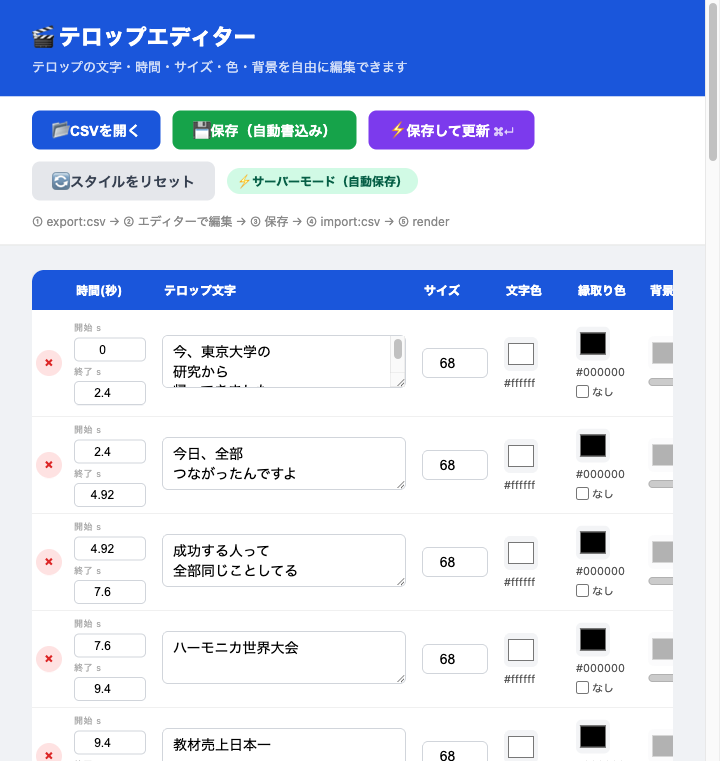

# 🎬 テロップエディター / Telop Editor

**初心者でも使えるAI動画用テロップ編集ツール**

✅ 初心者OK　✅ 5分で起動　✅ コピペだけで動作



テロップの文字・時間・サイズ・色・背景・効果音・縦位置をブラウザ上で編集し、動画生成用CSVを作れるツールです。

---

## ✨ できること

- テロップの**文字・開始秒・終了秒**を自由に編集
- **フォントサイズ・文字色・縁取り色・背景色**を変更
- **効果音**を各テロップに紐付け
- **縦位置（画面のどこに表示するか）**を調整
- 編集結果を1クリックで動画生成データに反映（`⚡️ 保存して更新`）
- リアルタイム**プレビュー**付き

---

## 🖥️ 動作環境

| 項目 | 内容 |
|------|------|
| OS | Mac（Windows は今後対応予定） |
| Node.js | v18 以上（v20 推奨） |
| ブラウザ | Chrome 推奨 |

---

## 📦 ダウンロード

1. このページ右上の緑の **「Code」ボタン** をクリック
2. **「Download ZIP」** を選択
3. ダウンロードされた ZIP ファイルを解凍

---

## 🚀 はじめかた（初めての方はここから）

### Step 1：Node.js をインストール

1. [https://nodejs.org/ja/](https://nodejs.org/ja/) を開く
2. **「LTS（推奨版）」** と書かれたボタンをクリックしてダウンロード
3. ダウンロードしたファイルをダブルクリックして「続ける」を押し続けてインストール完了

インストールできたか確認する方法：

```bash
node -v
```

`v18.x.x` 以上（`v20.x.x` 推奨）が表示されれば OK です。

---

### Step 2：ZIP を解凍してフォルダを開く

1. ダウンロードした ZIP ファイルをダブルクリックして解凍
2. 解凍されたフォルダを**デスクトップや書類フォルダ**に移動

---

### Step 3：ターミナルを起動してアプリを立ち上げる

1. Mac の **「Launchpad（ロケット型アイコン）」** を開く
2. 検索欄に「ターミナル」と入力して開く
3. ターミナルが開いたら、**解凍したフォルダをターミナルの黒い画面にドラッグ＆ドロップ**してください

> 💡 ドラッグすると `cd /Users/あなたの名前/...` のようなパスが自動で入力されます。そのまま Return キーを押してください。

4. 続けて以下を実行します

> ⚠️ **`npm install` は初回だけ実行してください。2回目以降は不要です。**

```bash
# ↓ 初回だけ実行（少し時間がかかります）
npm install
```

```bash
# ↓ 毎回これで起動します
npm run editor
```

5. ブラウザが自動で開き、`http://localhost:3001` でテロップエディターが表示されます

> ブラウザが開かない場合は、Chrome で `http://localhost:3001` を手動で開いてください。

> ⚠️ ターミナルを閉じるとアプリも止まります。使用中は開いたままにしてください。

---

## 🎯 まず「動いた！」を確認しよう

初めて使う方は、いきなり本番データを触らず、**サンプルCSVで動作確認**してください。

1. 「📂 CSVを開く」をクリック
2. `sample/beginner-sample.csv` を選ぶ
3. 「こんにちは！」「テストです」「完成！」の3行が表示されたら成功
4. 「こんにちは！」の文字を好きな言葉に変えて「⚡️ 保存して更新」を押す
5. 変化が確認できたら準備完了です

---

## 📝 使い方（3段階で覚える）

### 🥉 第1段階：CSV を編集する
CSV ファイルを開いて、テロップの文字・時間・色を編集するだけ。  
まずはここから始めましょう。

### 🥈 第2段階：保存して確認する
「⚡️ 保存して更新」を押すと、編集内容が保存されます。  
Remotion Studio でリロードすれば見た目を確認できます。

### 🥇 第3段階：動画を書き出す（render）
確認できたら `npm run render` で動画ファイルを生成します。  
完成した動画を SNS などに投稿できます。

---

### ボタン一覧

```
① CSVを開く  →  ② テロップを編集  →  ③「⚡️ 保存して更新」を押す  →  ④ Remotion をリロード
```

| ボタン | 説明 |
|--------|------|
| 📂 CSVを開く | 編集したい CSV ファイルを読み込む |
| 💾 保存（自動書き込み） | CSV ファイルだけを保存する |
| ⚡️ 保存して更新 | CSV 保存 ＋ 動画データを更新（メインで使うボタン） |
| 🔄 スタイルをリセット | 選択行のサイズ・色をデフォルトに戻す |
| ⚡ サーバーモード | 起動中に有効。自動保存になる |

> 💡 **ショートカット：キーボード左下の `⌘ Command` キーを押しながら `Return` キーを押すと「保存して更新」が実行されます。**

> 💡 **基本は「⚡️ 保存して更新」だけ押せば OK です。**

---

## 🔊 効果音ファイルについて

効果音は `public/sounds/` フォルダに入れてください。

| ファイル名 | 用途（例） |
|-----------|----------|
| se_intro.mp3 | オープニング |
| se_fanfare.mp3 | 実績・達成感 |
| se_achievement.mp3 | 強調 |
| se_pikon.mp3 | 一言ずつのリズム |
| se_impact.mp3 | 衝撃・インパクト |

---

## ❓ よくある質問

**Q. ブラウザが自動で開かない**
→ Chrome で `http://localhost:3001` を手動で開いてください。

**Q. `npm install` でエラーが出る**
→ Node.js が正しくインストールされているか確認してください（`node -v` を実行）

**Q. 「保存して更新」でエラーが出る**
→ ターミナルで `Ctrl + C` を押してから `npm run editor` を再実行してください。その後ブラウザを `Cmd + Shift + R` でリロードしてください。

**Q. テロップがズレる**
→ 開始秒・終了秒が正しいか確認してください。秒数は小数点対応（例：`4.92`）

**Q. 音が出ない**
→ 効果音ファイルが `public/sounds/` フォルダに入っているか確認してください。

詳しいトラブル対応 → [FAQ.md](docs/FAQ.md) を見てください。

---

## 👤 作者

**平松悟**  
AI動画クリエイター／ハーモニカ演奏家／シェイプアップ大学学長

<!-- SNSリンクをここに追加 -->

---

## 📬 サポート・お問い合わせ

質問・感想は配布元の **Facebook 投稿コメント欄** へどうぞ。

> ※ GitHub の Issues は現在サポート対象外です

---

## 📄 ライセンス

個人利用・商用利用ともに無料でお使いいただけます。  
再配布・改変の際は作者クレジットを記載してください。
